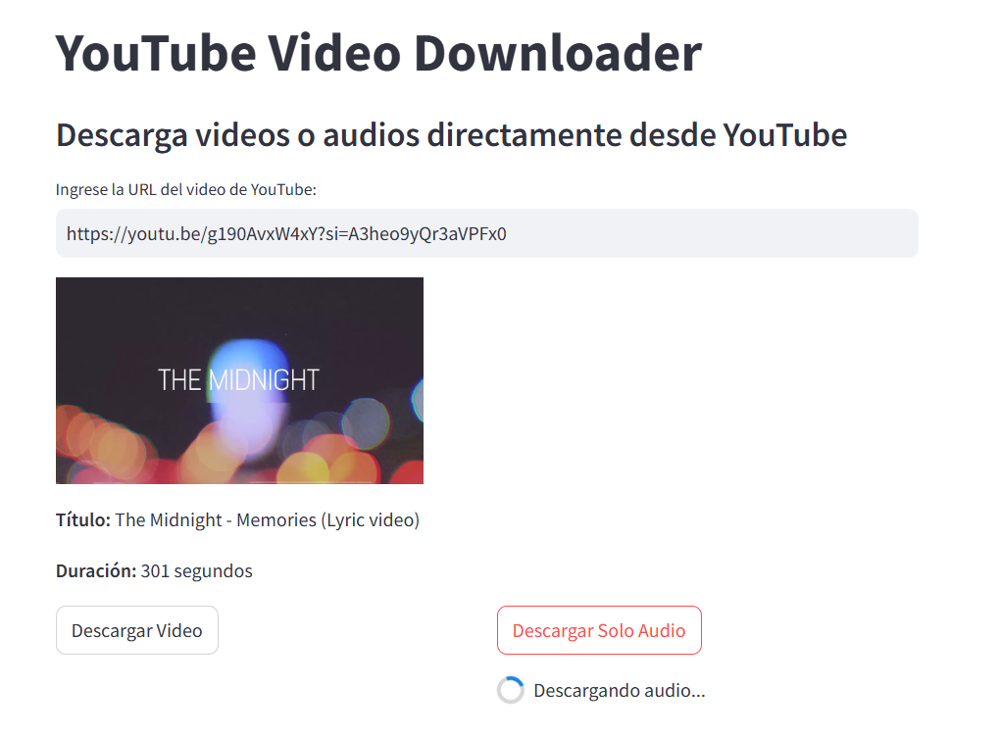

# YouTube Video Downloader  

A Streamlit-based application that lets you download YouTube videos and audio seamlessly. This lightweight yet powerful tool makes it easy to grab videos in the best available quality or extract high-quality audio for offline enjoyment.  



## 🚀 Features  
- **Video Download**: Download YouTube videos in the highest available resolution.  
- **Audio Extraction**: Convert and download audio from YouTube videos in MP3 format.  
- **Video Information Display**: View essential video details such as:  
  - Title  
  - Duration  
  - Thumbnail  
- **User-Friendly Interface**: Simple and intuitive design powered by Streamlit.  

## 📋 Requirements  
Ensure you have the following installed on your system before running the application:  
- Python 3.6 or higher  
- [yt-dlp](https://github.com/yt-dlp/yt-dlp): A modern YouTube downloader library.  
- [Streamlit](https://streamlit.io/): Framework for creating interactive web applications.  

## 🛠 Installation  

Follow these steps to set up and run the application locally:  

### 1. Clone the Repository  
Clone the repository to your local machine using the following command:  
```sh  
git clone https://github.com/yesner/dowload_videos_sound_youtube.git  
cd dowload_videos_sound_youtube  
